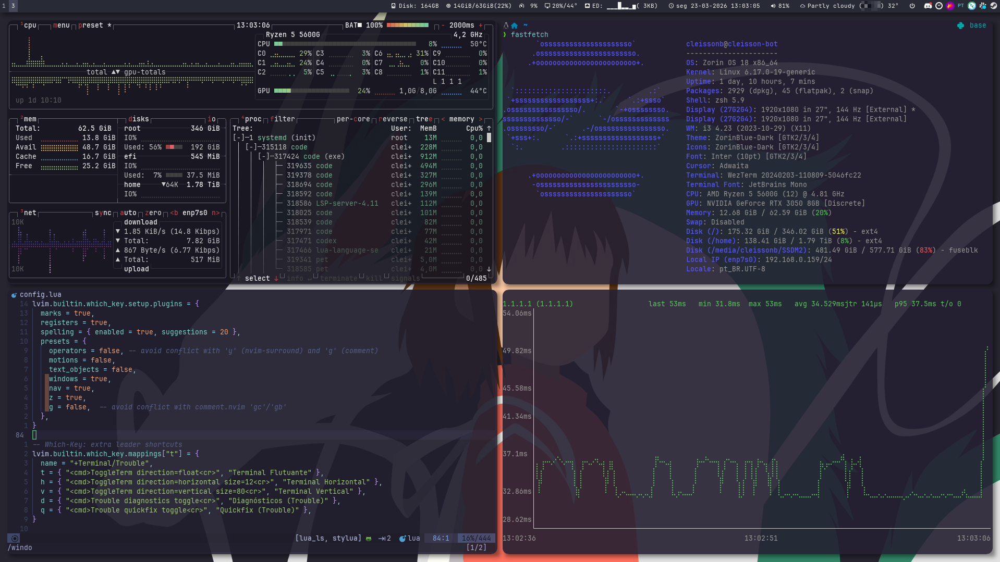
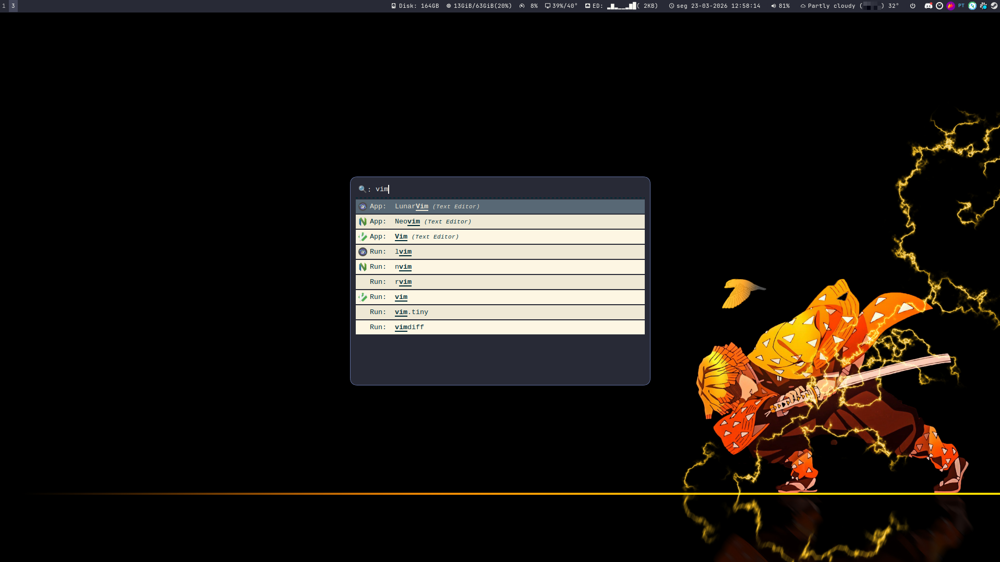
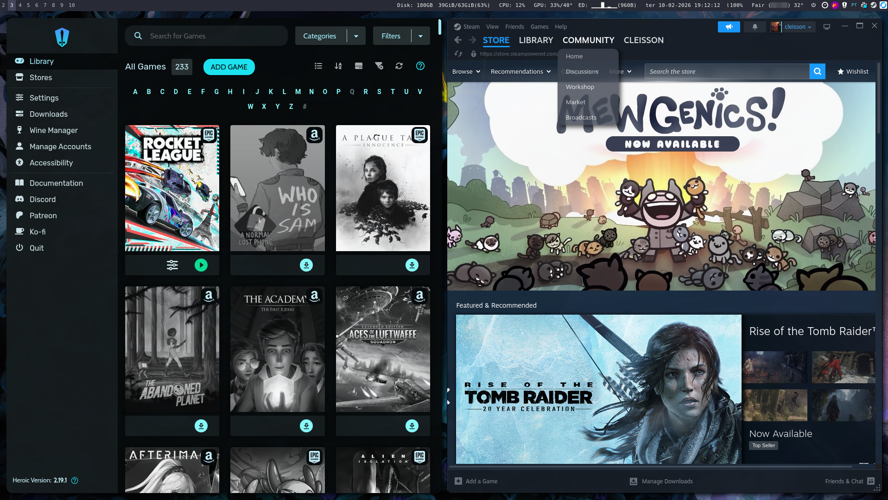
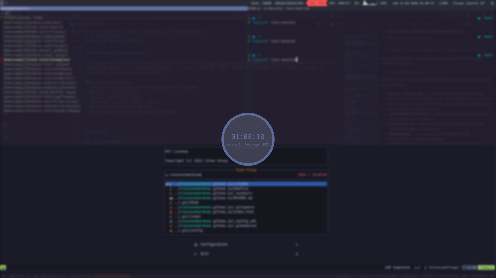

# My i3wm Config



Minha configuração pessoal do **i3 window manager** com tema **Dracula**, compositor **Picom**, barra de status **i3status-rs** e launcher **Rofi**.

---

## Componentes

| Componente           | Ferramenta                                                |
| -------------------- | --------------------------------------------------------- |
| Window Manager       | [i3wm](https://i3wm.org/) (i3-gaps)                       |
| Barra de Status      | [i3status-rs](https://github.com/greshake/i3status-rust)  |
| Compositor           | [Picom](https://github.com/yshui/picom)                   |
| Launcher             | [Rofi](https://github.com/davatorium/rofi)                |
| Tema                 | [Dracula](https://draculatheme.com/)                      |
| Wallpaper            | [feh](https://feh.finalrewind.org/) (slideshow aleatório) |
| Screenshot           | [Flameshot](https://flameshot.org/) (Flatpak)             |
| Lock Screen          | [i3lock-color](https://github.com/Raymo111/i3lock-color)  |
| Notificações de Rede | nm-applet                                                 |
| Fonte                | [JetBrainsMono Nerd Font](https://www.nerdfonts.com/)     |

---

## Instalação

### Instalador (script)

```bash
chmod +x install.sh
./install.sh
```

Modo nao-interativo com flags (exemplos):

```bash
# Aplica tudo e instala dependencias (padrao completo)
./install.sh --all --non-interactive

# Aplica configs sem dependencias
./install.sh --non-interactive --no-deps

# Personaliza diretorios
./install.sh --non-interactive --config-dir "$HOME/.config" --wallpaper-dir "$HOME/Pictures/desktop background"

# Instala extras opcionais no modo nao-interativo
./install.sh --all --non-interactive --with-gnome-settings --with-flameshot
```

### Dependências

```bash
# i3 e utilitários
sudo apt install i3 xss-lock dex numlockx feh

# i3lock-color (necessário para lock screen com tema Dracula)
# O i3lock padrão NÃO suporta as opções de personalização usadas nesta config.
# Instale o i3lock-color: https://github.com/Raymo111/i3lock-color#installation

# Compositor
sudo apt install picom

# Launcher
sudo apt install rofi

# Barra de status (i3status-rs)
# Veja: https://github.com/greshake/i3status-rust#installation

# Controle de volume e mídia
sudo apt install pulseaudio-utils playerctl

# Controle de brilho
sudo apt install light

# Rede
sudo apt install network-manager-gnome

# GNOME Settings (opcional, para $mod+Shift+s)
sudo apt install gnome-control-center

# Screenshot (Flatpak)
flatpak install flathub org.flameshot.Flameshot

# Navegadores
# Instale Brave e/ou Google Chrome manualmente

# Fontes (necessário para ícones e texto na barra)
# JetBrainsMono Nerd Font: https://www.nerdfonts.com/font-downloads
sudo apt install fonts-material-design-icons-iconfont
```

### Aplicando as configurações

```bash
# Clonar o repositório
git clone https://github.com/cleissonbarbosa/my-i3wm-config.git

# Copiar arquivos de configuração
cp my-i3wm-config/i3wm/config ~/.config/i3/config
cp my-i3wm-config/i3wm/i3status/config.toml ~/.config/i3status/config.toml
cp my-i3wm-config/picom/picom.conf ~/.config/picom/picom.conf

# Scripts do Rofi
cp my-i3wm-config/rofi/rofi_launcher.sh ~/rofi_launcher.sh
cp my-i3wm-config/rofi/rofi_sudo_launcher.sh ~/rofi_sudo_launcher.sh
cp my-i3wm-config/rofi/rofi-askpass ~/.local/bin/rofi-askpass

# Dar permissão de execução aos scripts
chmod +x ~/rofi_launcher.sh ~/rofi_sudo_launcher.sh ~/.local/bin/rofi-askpass

# Recarregar o i3
# $mod+Shift+r
```

---

## Atalhos de Teclado

> **Mod key** = `Super` (tecla Windows)

### Geral

| Atalho           | Ação                           |
| ---------------- | ------------------------------ |
| `$mod + Return`  | Abrir terminal                 |
| `$mod + Shift+q` | Fechar janela focada           |
| `$mod + d`       | Abrir Rofi (launcher)          |
| `$mod + Shift+d` | Abrir Rofi com sudo            |
| `$mod + Shift+s` | Abrir GNOME Settings           |
| `$mod + Shift+c` | Recarregar configuração do i3  |
| `$mod + Shift+r` | Reiniciar i3 (preserva sessão) |
| `$mod + Shift+e` | Sair do i3                     |

### Navegação

| Atalho                   | Ação                                     |
| ------------------------ | ---------------------------------------- |
| `$mod + j/k/l/ç`         | Focar esquerda/baixo/cima/direita        |
| `$mod + Setas`           | Focar esquerda/baixo/cima/direita        |
| `$mod + Shift + j/k/l/ç` | Mover janela esquerda/baixo/cima/direita |
| `$mod + Shift + Setas`   | Mover janela esquerda/baixo/cima/direita |
| `$mod + 1-9,0`           | Trocar para workspace 1-10               |
| `$mod + Shift + 1-9,0`   | Mover janela para workspace 1-10         |

### Layout

| Atalho               | Ação                          |
| -------------------- | ----------------------------- |
| `$mod + h`           | Split horizontal              |
| `$mod + v`           | Split vertical                |
| `$mod + f`           | Fullscreen                    |
| `$mod + s`           | Layout stacking               |
| `$mod + w`           | Layout tabbed                 |
| `$mod + e`           | Layout toggle split           |
| `$mod + Shift+Space` | Alternar tiling/floating      |
| `$mod + Space`       | Alternar foco tiling/floating |
| `$mod + r`           | Modo resize                   |

### Aplicativos

| Atalho     | Ação                   |
| ---------- | ---------------------- |
| `$mod + b` | Abrir Brave Browser    |
| `$mod + c` | Abrir Google Chrome    |
| `Print`    | Screenshot (Flameshot) |

### Mídia e Hardware

| Atalho                  | Ação                     |
| ----------------------- | ------------------------ |
| `XF86AudioRaiseVolume`  | Aumentar volume (+10%)   |
| `XF86AudioLowerVolume`  | Diminuir volume (-10%)   |
| `XF86AudioMute`         | Mutar/desmutar           |
| `XF86AudioMicMute`      | Mutar/desmutar microfone |
| `XF86AudioPlay`         | Play/Pause               |
| `XF86AudioNext`         | Próxima faixa            |
| `XF86AudioPrev`         | Faixa anterior           |
| `XF86AudioStop`         | Parar reprodução         |
| `XF86MonBrightnessUp`   | Aumentar brilho (+5)     |
| `XF86MonBrightnessDown` | Diminuir brilho (-5)     |

---

## Configuração de Monitores

Setup dual-monitor com ambos em **1920x1080 @ 144Hz**:

- **DP-0** — Monitor esquerdo (principal, com tray)
- **DP-4** — Monitor direito

> Ajuste os nomes das saídas (`DP-0`, `DP-4`) conforme seu hardware usando `xrandr --query`.

---

## Barra de Status (i3status-rs)

Posição: **topo** | Tema: **Dracula** | Ícones: **Material**

### Blocos configurados

| Bloco        | Informação                                         |
| ------------ | -------------------------------------------------- |
| `disk_space` | Espaço disponível em `/`                           |
| `memory`     | Uso de RAM (alerta em 70%, crítico em 90%)         |
| `cpu`        | Utilização da CPU                                  |
| `nvidia_gpu` | Utilização e temperatura da GPU NVIDIA             |
| `net`        | Velocidade de rede (interface `enp7s0`)            |
| `time`       | Data e hora (formato `Seg 01-01-2026 14:30:00`)    |
| `sound`      | Volume do áudio                                    |
| `weather`    | Clima atual (via Met.no, auto-localização)         |
| `menu`       | Menu de energia (Suspender / Desligar / Reiniciar) |

---

## Picom (Compositor)

| Efeito              | Configuração                           |
| ------------------- | -------------------------------------- |
| Backend             | xrender                                |
| Sombras             | Ativadas (raio: 12px, opacidade: 0.45) |
| Fading              | Ativado (delta: 4ms)                   |
| Opacidade inativa   | 99%                                    |
| Opacidade do frame  | 98%                                    |
| Cantos arredondados | 12px                                   |
| Blur de fundo       | Desativado                             |
| VSync               | Ativado                                |
| Opacidade URxvt     | 80%                                    |

> Exclusões de sombra/cantos: Conky, dock, desktop, i3-frame.

---

## Wallpaper

O feh troca automaticamente o wallpaper a cada **30 segundos**, selecionando aleatoriamente da pasta `~/Pictures/desktop background/`.

Coloque seus wallpapers nesse diretório para ativar o slideshow.

---

## Tema de Cores (Dracula)

As cores são definidas como **variáveis no config do i3**, facilitando a manutenção e consistência:

- `$backgroundColor` =  `#282a36`
- `$foreground` =  `#f8f8f2`
- `$selection` =  `#44475a`
- `$comment` =  `#6272a4`
- `$red` =  `#ff5555`
- `$green` =  `#50fa7b`
- `$yellow` =  `#f1fa8c`
- `$orange` =  `#ffb86c`
- `$magenta` =  `#ff79c6`
- `$cyan` =  `#8be9fd`
- `$blue` =  `#6272a4`

Aplicado de forma consistente em: i3wm (bordas, barra, i3lock), Rofi e i3status-rs.

---

## Lock Screen (i3lock-color)

> **Importante:** O lock screen utiliza [i3lock-color](https://github.com/Raymo111/i3lock-color), que é um fork do i3lock com suporte a customização visual. O `i3lock` padrão **não** suporta as opções de cor, blur, relógio e indicador usadas nesta configuração.

Recursos configurados:

- Tema Dracula com cores personalizadas no indicador
- Blur de fundo (nível 5)
- Relógio com data e hora
- Indicador circular (raio: 120px)
- Fonte JetBrainsMono Nerd Font
- Passthrough de teclas de mídia e volume

---

## Galeria

### Rofi Launcher



### Games



### Workflow


### Lock Screen


