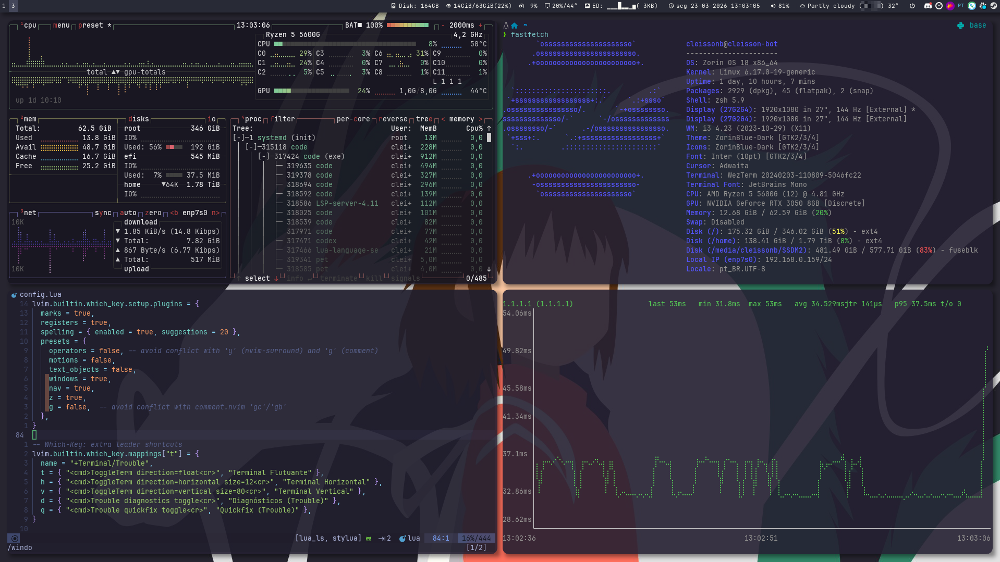
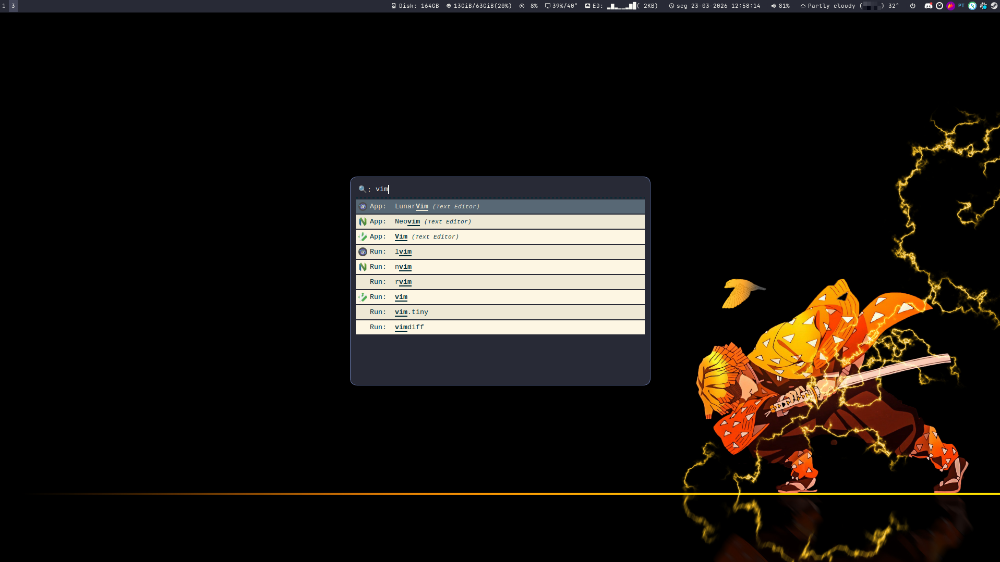
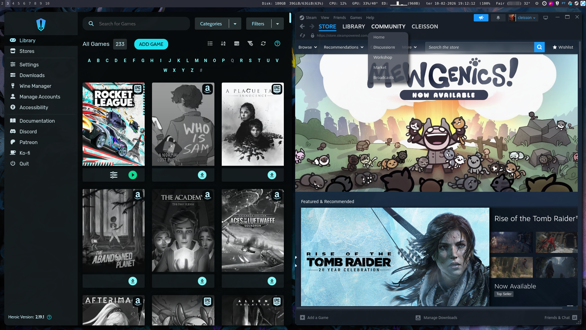
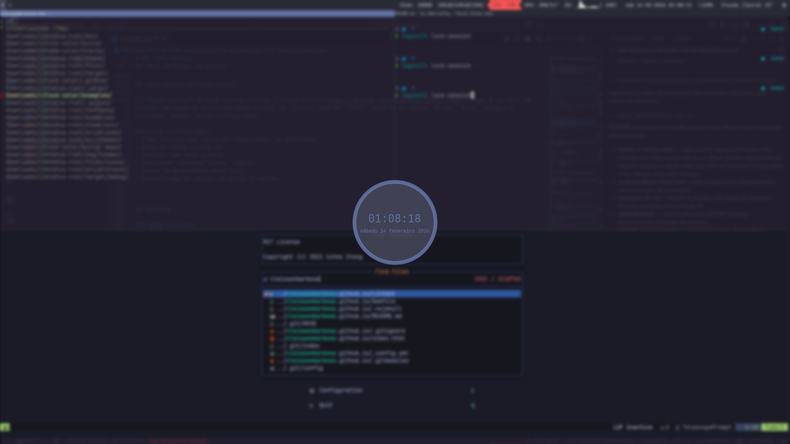

# My i3wm setup for Zorin OS



My personal configuration for i3 (i3-gaps). I use the Dracula theme, Picom as a compositor, i3status-rs for the status bar, and Rofi as a launcher. This repository provides ready-to-copy scripts and configuration files for `~/.config` and `~/.local/bin`.

The alternating split behavior is provided by the upstream project [olemartinorg/i3-alternating-layout](https://github.com/olemartinorg/i3-alternating-layout), which is now included here as a Git submodule in `i3wm/scripts/i3-alternating-layout`.

---

## Components

| Component            | Tool                                                    |
| -------------------- | --------------------------------------------------------|
| Window Manager       | [i3wm](https://i3wm.org/) (i3-gaps)                     |
| Terminal             | [WezTerm](https://wezterm.org/)                         |
| Status Bar           | [i3status-rs](https://github.com/greshake/i3status-rust)|
| Compositor           | [Picom](https://github.com/yshui/picom)                 |
| Launcher             | [Rofi](https://github.com/davatorium/rofi)              |
| Theme                | [Dracula](https://draculatheme.com/)                    |
| Wallpaper            | [feh](https://feh.finalrewind.org/) (random slideshow)  |
| Screenshot           | [Flameshot](https://flameshot.org/) (Flatpak)           |
| Lock Screen          | [i3lock-color](https://github.com/Raymo111/i3lock-color)|
| Network Notifications| nm-applet                                               |
| Font                 | [JetBrainsMono Nerd Font](https://www.nerdfonts.com/)   |

---

## Quick Installation

Clone the repository with submodules, then run the installer:

```bash
git clone --recursive https://github.com/cleissonbarbosa/my-i3wm-config.git
cd my-i3wm-config
chmod +x install.sh
./install.sh
```

If you already cloned the repository without submodules, run:

```bash
git submodule update --init --recursive
```

Non-interactive mode with flags (examples):

```bash
# Apply everything and install dependencies (full default)
./install.sh --all --non-interactive

# Apply configs without dependencies
./install.sh --non-interactive --no-deps

# Customize directories
./install.sh --non-interactive --config-dir "$HOME/.config" --wallpaper-dir "$HOME/Pictures/desktop background"

# Install optional extras in non-interactive mode
./install.sh --all --non-interactive --with-gnome-settings --with-flameshot
```

### Dependencies

```bash
# i3 and utilities
sudo apt install git python3-i3ipc i3 xss-lock dex numlockx feh

# i3lock-color (required for Dracula-themed lock screen)
# The default i3lock does NOT support the customization options used in this config.
# Install i3lock-color: https://github.com/Raymo111/i3lock-color#installation

# Compositor
sudo apt install picom

# Terminal emulator
# Install WezTerm from the official instructions for your distro:
# https://wezterm.org/install/linux.html

# Launcher
sudo apt install rofi

# Status bar (i3status-rs)
# See: https://github.com/greshake/i3status-rust#installation

# Volume and media control
sudo apt install pulseaudio-utils playerctl

# Brightness control
sudo apt install light

# Network
sudo apt install network-manager-gnome

# GNOME Settings (optional, for $mod+Shift+s)
sudo apt install gnome-control-center

# Screenshot (Flatpak)
flatpak install flathub org.flameshot.Flameshot

# Browsers
# Install Brave and/or Google Chrome manually

# Fonts (required for icons and text in the bar)
# JetBrainsMono Nerd Font: https://www.nerdfonts.com/font-downloads
sudo apt install fonts-material-design-icons-iconfont
```

### Applying the Configurations

Clone the repository and copy the files:

```bash
# Clone the repository with submodules
git clone --recursive https://github.com/cleissonbarbosa/my-i3wm-config.git

# If needed later
git -C my-i3wm-config submodule update --init --recursive

# Copy configuration files
cp my-i3wm-config/i3wm/config ~/.config/i3/config
cp my-i3wm-config/i3wm/i3status/config.toml ~/.config/i3status/config.toml
cp my-i3wm-config/picom/picom.conf ~/.config/picom/picom.conf
cp my-i3wm-config/wezterm/.wezterm.lua ~/.wezterm.lua

# Copy i3 helper scripts, including the upstream alternating layout submodule
mkdir -p ~/.config/i3/scripts
cp -r my-i3wm-config/i3wm/scripts/. ~/.config/i3/scripts/
chmod +x ~/.config/i3/scripts/i3-alternating-layout/alternating_layouts.py

# Rofi scripts
cp my-i3wm-config/rofi/rofi_launcher.sh ~/rofi_launcher.sh
cp my-i3wm-config/rofi/rofi_sudo_launcher.sh ~/rofi_sudo_launcher.sh
cp my-i3wm-config/rofi/rofi-askpass ~/.local/bin/rofi-askpass

# Make scripts executable
chmod +x ~/rofi_launcher.sh ~/rofi_sudo_launcher.sh ~/.local/bin/rofi-askpass

# Reload i3
# $mod+Shift+r
```

Reload i3 with `$mod+Shift+r`.

---

## WezTerm

The repository now includes my WezTerm config in `wezterm/.wezterm.lua`.

Highlights:

- no title bar or tab bar
- thin split line and zero padding
- Gruvbox-based palette adapted to match the desktop colors
- pane navigation with `Alt + Arrow keys`
- pane splitting with `Alt+e` and `Alt+o`
- pane close with `Alt+w`

The installer copies this file to `~/.wezterm.lua`.

---

## Keyboard Shortcuts

> **Mod key** = `Super` (Windows key)

### General

| Shortcut           | Action                         |
| ------------------ | -------------------------------|
| `$mod + Return`    | Open terminal                  |
| `$mod + Shift+q`   | Close focused window           |
| `$mod + d`         | Open Rofi (launcher)           |
| `$mod + Shift+d`   | Open Rofi with sudo            |
| `$mod + Shift+s`   | Open GNOME Settings            |
| `$mod + Shift+c`   | Reload i3 configuration        |
| `$mod + Shift+r`   | Restart i3 (preserve session)  |
| `$mod + Shift+e`   | Exit i3                        |

### Navigation

| Shortcut                  | Action                                 |
| ------------------------- | -------------------------------------- |
| `$mod + j/k/l/ç`          | Focus left/down/up/right               |
| `$mod + Arrows`           | Focus left/down/up/right               |
| `$mod + Shift + j/k/l/ç`  | Move window left/down/up/right         |
| `$mod + Shift + Arrows`   | Move window left/down/up/right         |
| `$mod + 1-9,0`            | Switch to workspace 1-10               |
| `$mod + Shift + 1-9,0`    | Move window to workspace 1-10          |

### Layout

| Shortcut              | Action                         |
| --------------------- | ------------------------------ |
| `$mod + h`            | Split horizontal               |
| `$mod + v`            | Split vertical                 |
| `$mod + f`            | Fullscreen                     |
| `$mod + s`            | Layout stacking                |
| `$mod + w`            | Layout tabbed                  |
| `$mod + e`            | Layout toggle split            |
| `$mod + Shift+Space`  | Toggle tiling/floating         |
| `$mod + Space`        | Toggle focus tiling/floating   |
| `$mod + r`            | Resize mode                    |

### Applications

| Shortcut     | Action                |
| ------------ | --------------------- |
| `$mod + b`   | Open Brave Browser    |
| `$mod + c`   | Open Google Chrome    |
| `Print`      | Screenshot (Flameshot)|

### Media and Hardware

| Shortcut                 | Action                    |
| ------------------------ | ------------------------- |
| `XF86AudioRaiseVolume`   | Increase volume (+10%)    |
| `XF86AudioLowerVolume`   | Decrease volume (-10%)    |
| `XF86AudioMute`          | Mute/unmute               |
| `XF86AudioMicMute`       | Mute/unmute microphone    |
| `XF86AudioPlay`          | Play/Pause                |
| `XF86AudioNext`          | Next track                |
| `XF86AudioPrev`          | Previous track            |
| `XF86AudioStop`          | Stop playback             |
| `XF86MonBrightnessUp`    | Increase brightness (+5)  |
| `XF86MonBrightnessDown`  | Decrease brightness (-5)  |

---

## Monitor Setup

Dual-monitor setup with both at **1920x1080 @ 144Hz**:

- **DP-0** — Left monitor (primary, with tray)
- **DP-4** — Right monitor

> Adjust the output names (`DP-0`, `DP-4`) according to your hardware using `xrandr --query`.

---

## Status Bar (i3status-rs)

Position: **top** | Theme: **Dracula** | Icons: **Material**

### Configured Blocks

| Block         | Information                                      |
| ------------- | ------------------------------------------------ |
| `disk_space`  | Available space on `/`                           |
| `memory`      | RAM usage (alert at 70%, critical at 90%)        |
| `cpu`         | CPU utilization                                  |
| `nvidia_gpu`  | NVIDIA GPU usage and temperature                 |
| `net`         | Network speed (interface `enp7s0`)               |
| `time`        | Date and time (format `Mon 01-01-2026 14:30:00`) |
| `sound`       | Audio volume                                     |
| `weather`     | Current weather (via Met.no, auto-location)      |
| `menu`        | Power menu (Suspend / Shutdown / Restart)        |

---

## Picom (Compositor)

Note: I am using Picom v13 compiled locally — this version includes animation support that improves transitions and visual effects.

| Effect              | Configuration                        |
| ------------------- | ------------------------------------ |
| Animations          | Enabled                              |
| Backend             | xrender                              |
| Shadows             | Enabled (radius: 12px, opacity: 0.45)|
| Fading              | Enabled (delta: 4ms)                 |
| Inactive Opacity    | 99%                                  |
| Frame Opacity       | 98%                                  |
| Rounded Corners     | 12px                                 |
| Background Blur     | Disabled                             |
| VSync               | Enabled                              |
| URxvt Opacity       | 80%                                  |

> Shadow/corner exclusions: Conky, dock, desktop, i3-frame.

---

## Wallpaper

feh automatically changes the wallpaper every **30 seconds**, randomly selecting from the `~/Pictures/desktop background/` folder.

Place your wallpapers in this directory to activate the slideshow.

---

## Color Theme (Dracula)

Colors are defined as **variables in the i3 config**, making maintenance and consistency easier:

- `$backgroundColor` =  `#282a36`
- `$foreground` =  `#f8f8f2`
- `$selection` =  `#44475a`
- `$comment` =  `#6272a4`
- `$red` =  `#ff5555`
- `$green` =  `#50fa7b`
- `$yellow` =  `#f1fa8c`
- `$orange` =  `#ffb86c`
- `$magenta` =  `#ff79c6`
- `$cyan` =  `#8be9fd`
- `$blue` =  `#6272a4`

Applied consistently in: i3wm (borders, bar, i3lock), Rofi, and i3status-rs.

---

## Lock Screen (i3lock-color)

> **Important:** The lock screen uses [i3lock-color](https://github.com/Raymo111/i3lock-color), which is a fork of i3lock with support for visual customization. The default `i3lock` **does not** support the color, blur, clock, and indicator options used in this configuration.

Configured features:

- Dracula theme with customized indicator colors
- Background blur (level 5)
- Clock with date and time
- Circular indicator (radius: 120px)
- JetBrainsMono Nerd Font
- Media and volume key passthrough

---

## Gallery

### Rofi Launcher



### Games



### Workflow


### Lock Screen


