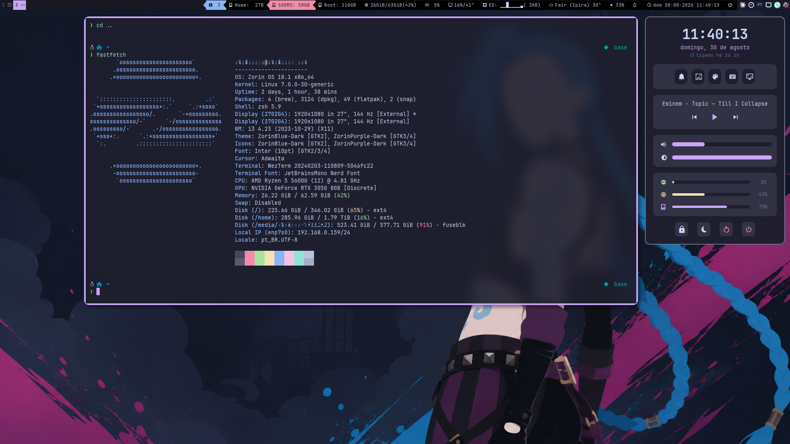
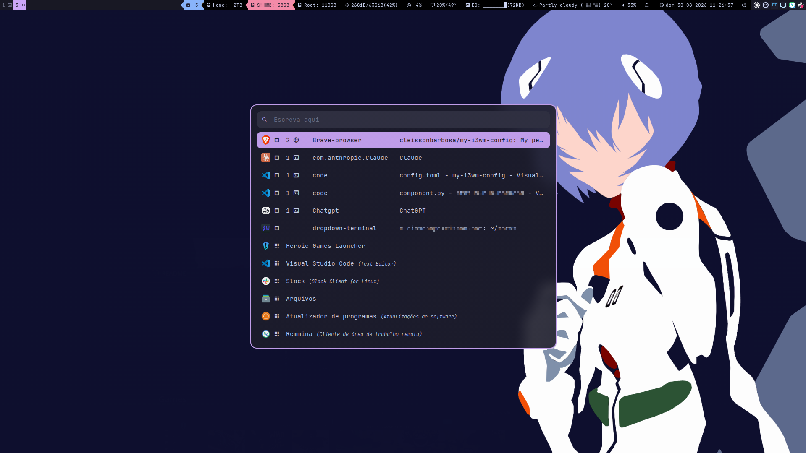
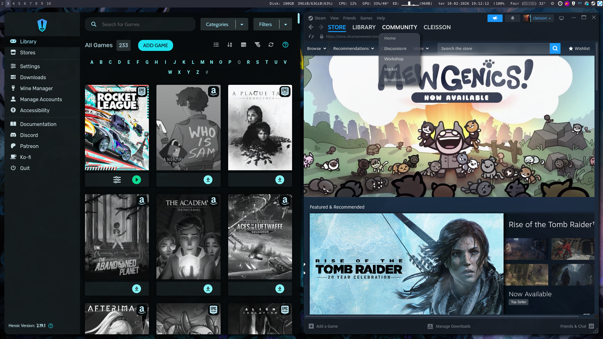
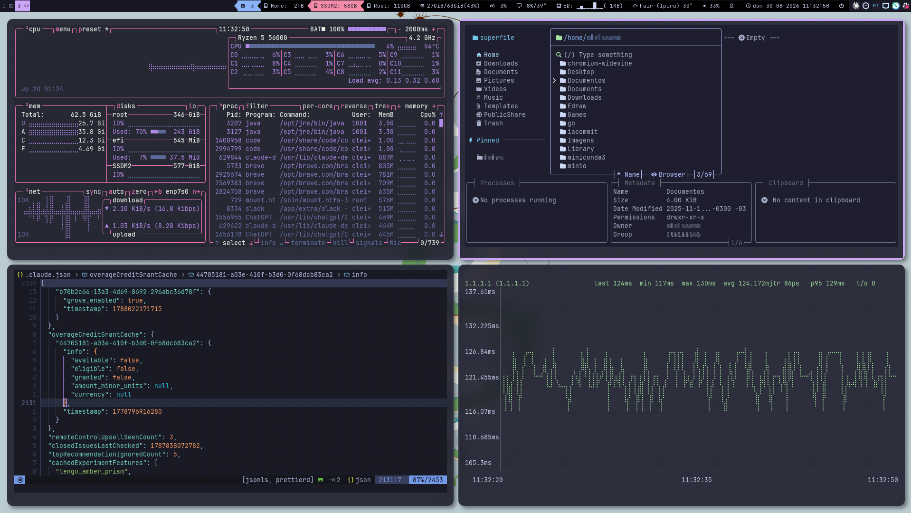
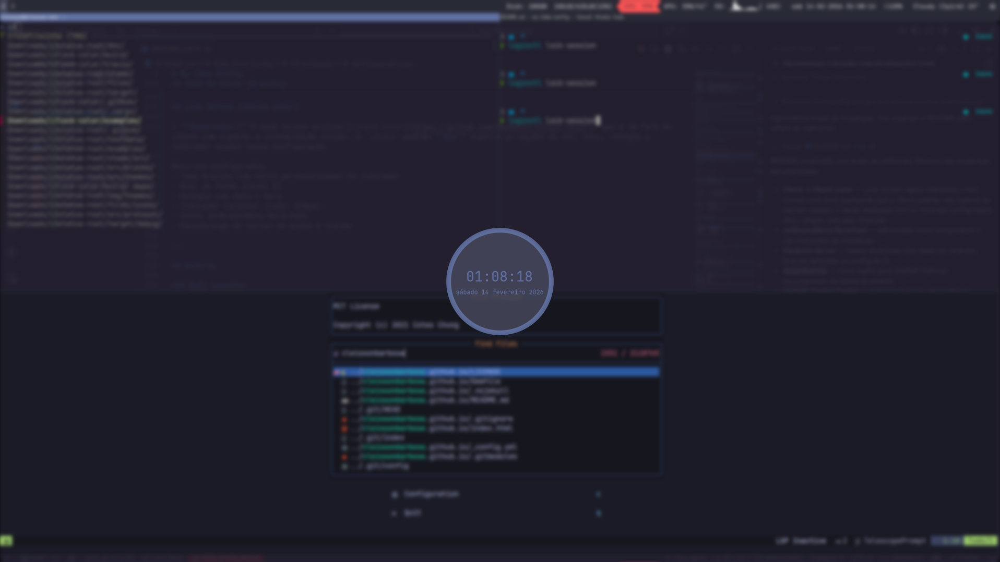
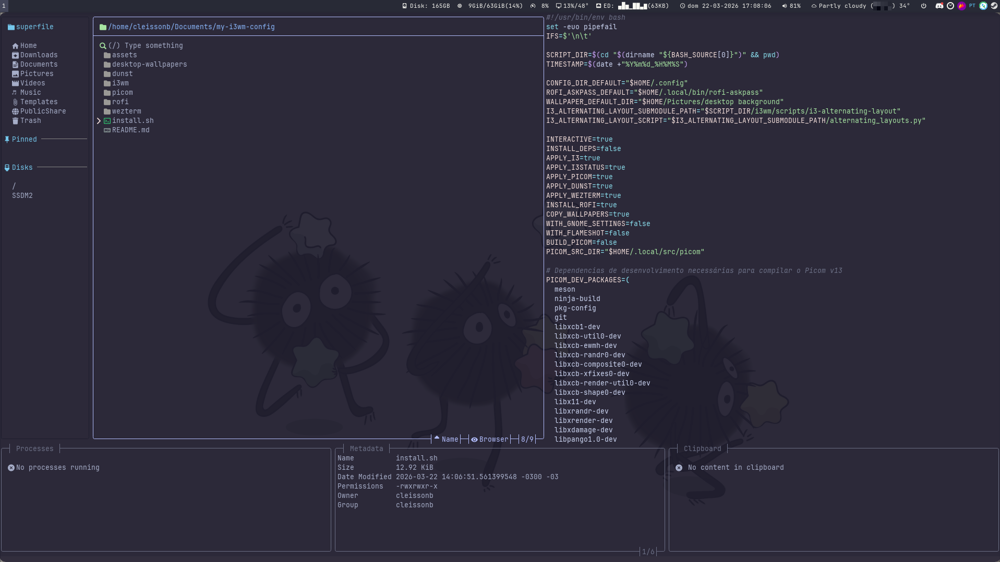

# My i3wm setup for Zorin OS



My personal configuration for i3 (i3-gaps), with Picom, i3status-rs, WezTerm and Rofi. A single theme switcher keeps i3, Rofi, Dunst, WezTerm, i3status-rs, Eww, GTK and the lock screen synchronized across Dracula, Gruvbox, Catppuccin Mocha, Tokyo Night and Nord. The installer symlinks configuration files into `~/.config` and `~/.local/bin` by default, so the repository stays the single source of truth (use `--copy` for standalone copies).

The alternating split behavior is provided by the upstream project [olemartinorg/i3-alternating-layout](https://github.com/olemartinorg/i3-alternating-layout), which is now included here as a Git submodule in `i3wm/scripts/i3-alternating-layout`.

---

## Components

| Component            | Tool                                                    |
| -------------------- | --------------------------------------------------------|
| Window Manager       | [i3wm](https://i3wm.org/) (i3-gaps)                     |
| Terminal             | [WezTerm](https://wezterm.org/)                         |
| Status Bar           | [i3status-rs](https://github.com/greshake/i3status-rust)|
| Compositor           | [Picom](https://github.com/yshui/picom)                 |
| Launcher             | [Rofi](https://github.com/davatorium/rofi)              |
| Themes               | Dracula, Gruvbox, Catppuccin Mocha, Tokyo Night, Nord   |
| Wallpaper            | [feh](https://feh.finalrewind.org/) (random slideshow)  |
| Screenshot           | [Spectacle](https://apps.kde.org/spectacle/) (`kde-spectacle`) |
| Screen recording     | ffmpeg / x11grab via `screen-record.sh`                 |
| Lock Screen          | [i3lock-color](https://github.com/Raymo111/i3lock-color)|
| Notifications / OSD  | Dunst                                                  |
| Optional dashboard   | Eww                                                    |
| Clipboard history    | Greenclip                                              |
| Auto layout          | [autotiling](https://github.com/nwg-piotr/autotiling)   |
| Network Notifications| nm-applet                                               |
| Font                 | [JetBrainsMono Nerd Font](https://www.nerdfonts.com/)   |

---

## Quick Installation

Clone the repository with submodules, then run the installer:

```bash
git clone --recursive https://github.com/cleissonbarbosa/my-i3wm-config.git
cd my-i3wm-config
chmod +x install.sh
./install.sh
```

If you already cloned the repository without submodules, run:

```bash
git submodule update --init --recursive
```

Non-interactive mode with flags (examples):

```bash
# Apply everything and install dependencies (full default)
./install.sh --all --non-interactive

# Apply configs without dependencies
./install.sh --non-interactive --no-deps

# Copy files instead of symlinking (default is symlink)
./install.sh --non-interactive --no-deps --copy

# Customize directories
./install.sh --non-interactive --config-dir "$HOME/.config" --wallpaper-dir "$HOME/Pictures/desktop background"

# Install optional extras in non-interactive mode
./install.sh --all --non-interactive --with-gnome-settings --with-spectacle
```

### Dependencies

```bash
# i3 and utilities
sudo apt install git python3-i3ipc i3 xss-lock dex numlockx feh

# i3lock-color (required for the themed lock screen)
# The default i3lock does NOT support the customization options used in this config.
# Install i3lock-color: https://github.com/Raymo111/i3lock-color#installation

# Compositor
sudo apt install picom

# Terminal emulator
# Install WezTerm from the official instructions for your distro:
# https://wezterm.org/install/linux.html

# Launcher
sudo apt install rofi

# Status bar (i3status-rs)
# See: https://github.com/greshake/i3status-rust#installation

# Volume and media control (wpctl comes with WirePlumber/PipeWire)
sudo apt install wireplumber playerctl

# Notifications, history, calculator clipboard and lock-screen cache
sudo apt install dunst jq xclip imagemagick

# Brightness control
sudo apt install light

# Clipboard history (the installer downloads the static binary)
# https://github.com/erebe/greenclip/releases

# Focus flash, workspace save/restore and emoji picker
# The installer creates an isolated venv under ~/.local/share/my-i3wm-config.
sudo apt install python3-venv

# Optional control-center dashboard (Eww)
# Build/install Eww separately, then the installer applies eww/ to ~/.config/eww.
# Native build dependencies on Ubuntu/Zorin:
sudo apt install libgtk-3-dev libgtk-layer-shell-dev libdbusmenu-gtk3-dev
# https://elkowar.github.io/eww/

# Network
sudo apt install network-manager-gnome

# GNOME Settings (optional, for $mod+Shift+s)
sudo apt install gnome-control-center

# Screenshot
# Both extras are required and neither is a dependency of kde-spectacle:
#   qml-module-qtquick-shapes  without it the region selector never appears
#                              (Spectacle just exits silently)
#   breeze-icon-theme          without it the annotation toolbar has no icons
#                              (KIconThemes defaults to "breeze")
sudo apt install kde-spectacle qml-module-qtquick-shapes breeze-icon-theme

# Screen recording (Spectacle cannot record; screen-record.sh uses x11grab)
sudo apt install ffmpeg

# Browsers
# Install Brave and/or Google Chrome manually

# Fonts (required for icons and text in the bar)
# The installer downloads JetBrainsMono Nerd Font to ~/.local/share/fonts automatically.
# Manual install: https://www.nerdfonts.com/font-downloads
```

### Applying the Configurations Manually

The installer symlinks everything for you, but the manual equivalent is:

```bash
# Clone the repository with submodules
git clone --recursive https://github.com/cleissonbarbosa/my-i3wm-config.git
cd my-i3wm-config

# If needed later
git submodule update --init --recursive

# Symlink configuration files (repository stays the source of truth)
mkdir -p ~/.config/i3 ~/.config/i3status ~/.config/picom ~/.config/dunst \
  ~/.config/rofi ~/.config/flashfocus ~/.local/bin
ln -sn "$PWD/i3wm/config" ~/.config/i3/config
ln -sn "$PWD/i3wm/scripts" ~/.config/i3/scripts
ln -sn "$PWD/i3wm/i3status/config.toml" ~/.config/i3status/config.toml
ln -sn "$PWD/picom/picom.conf" ~/.config/picom/picom.conf
ln -sn "$PWD/wezterm/.wezterm.lua" ~/.wezterm.lua
ln -sn "$PWD/flashfocus/flashfocus.yml" ~/.config/flashfocus/flashfocus.yml
ln -sn "$PWD/eww" ~/.config/eww

# Rofi and desktop helper scripts (all executables live in ~/.local/bin)
ln -sn "$PWD/rofi/rofi_launcher.sh" ~/.local/bin/rofi_launcher.sh
ln -sn "$PWD/rofi/rofi_sudo_launcher.sh" ~/.local/bin/rofi_sudo_launcher.sh
ln -sn "$PWD/rofi/rofi-askpass" ~/.local/bin/rofi-askpass
ln -sn "$PWD/rofi/rofi_powermenu.sh" ~/.local/bin/rofi_powermenu.sh
ln -sn "$PWD/rofi/rofi_confirm.sh" ~/.local/bin/rofi_confirm.sh
ln -sn "$PWD/rofi/rofi_calc.sh" ~/.local/bin/rofi_calc.sh
ln -sn "$PWD/rofi/rofi_clipboard.sh" ~/.local/bin/rofi_clipboard.sh
ln -sn "$PWD/rofi/rofi_wifi.sh" ~/.local/bin/rofi_wifi.sh
ln -sn "$PWD/rofi/rofi_keybinds.sh" ~/.local/bin/rofi_keybinds.sh
ln -sn "$PWD/dunst/dunst-history.sh" ~/.local/bin/dunst-history.sh
ln -sn "$PWD/dunst/dunst-dnd.sh" ~/.local/bin/dunst-dnd.sh
ln -sn "$PWD/themes/theme-switcher.sh" ~/.local/bin/theme-switcher.sh

# Generate the active Rofi/Dunst/theme files (without restarting the session)
./themes/theme-switcher.sh dracula --no-reload
```

Reload i3 with `$mod+Shift+r`.

---

## WezTerm

The repository now includes my WezTerm config in `wezterm/.wezterm.lua`.

Highlights:

- no title bar or tab bar
- thin split line and a small padding, so picom's 12px corner radius does not
  clip the glyphs in the corner rows
- JetBrainsMono Nerd Font, the same patched build the bar and Rofi use, so
  prompt/starship icons render inside the terminal too
- palette loaded from the active desktop theme and reloaded automatically
- pane navigation with `Alt + Arrow keys`
- pane splitting with `Alt+e` and `Alt+o`
- pane close with `Alt+w`

The installer links this file to `~/.wezterm.lua` by default.

---

## Keyboard Shortcuts

> **Mod key** = `Super` (Windows key)

### General

| Shortcut           | Action                         |
| ------------------ | -------------------------------|
| `$mod + Return`    | Open terminal                  |
| `$mod + Shift+q`   | Close focused window           |
| `$mod + d`         | Open Rofi (launcher)           |
| `$mod + Shift+d`   | Open Rofi with sudo            |
| `$mod + p`         | Open power menu                |
| `$mod + Shift+v`   | Open clipboard history         |
| `$mod + equal`     | Open calculator                |
| `$mod + period`    | Open emoji picker              |
| `$mod + Shift+t`   | Select and apply a color theme |
| `$mod + o`         | Toggle the Eww dashboard       |
| `$mod + t`         | Toggle dropdown terminal       |
| `$mod + F9/F10`    | Save/restore current workspace |
| `$mod + Escape`    | Lock screen                    |
| `$mod + Shift+s`   | Open GNOME Settings            |
| `$mod + Shift+n`   | Re-show last notification      |
| `$mod + Shift+h`   | Notification history (rofi)    |
| `$mod + Shift+,`   | Toggle do-not-disturb (dunst)  |
| `$mod + Shift+i`   | Wi-Fi picker (nmcli + rofi)    |
| `$mod + F1`        | Searchable keybinding cheat sheet |
| `$mod + F5`        | Skip to the next wallpaper     |
| `$mod + Shift+b`   | Hide/show the bar              |
| `$mod + Shift+c`   | Reload i3 configuration        |
| `$mod + Shift+r`   | Restart i3 (preserve session)  |
| `$mod + Shift+e`   | Exit i3                        |

### Navigation

| Shortcut                  | Action                                 |
| ------------------------- | -------------------------------------- |
| `$mod + j/k/l/ç`          | Focus left/down/up/right               |
| `$mod + Arrows`           | Focus left/down/up/right               |
| `$mod + Shift + j/k/l/ç`  | Move window left/down/up/right         |
| `$mod + Shift + Arrows`   | Move window left/down/up/right         |
| `$mod + 1-9,0`            | Switch to workspace 1-10               |
| `$mod + Shift + 1-9,0`    | Move window to workspace 1-10          |
| `$mod + Tab`              | Back and forth between workspaces      |
| `$mod + Shift + minus`    | Move window to scratchpad              |
| `$mod + minus`            | Show/cycle scratchpad windows          |

### Dual monitor

| Shortcut                        | Action                                     |
| ------------------------------- | ------------------------------------------ |
| `$mod + Ctrl + j/ç`             | Focus the left/right monitor               |
| `$mod + Ctrl + Left/Right`      | Focus the left/right monitor               |
| `$mod + Ctrl + Shift + j/ç`     | Move the window to the other monitor       |
| `$mod + Ctrl + < / >`           | Move the whole workspace to the other monitor |
| `$mod + Ctrl + Up/Down`         | Previous/next workspace on this monitor    |
| `$mod + Shift + y`              | Sticky: keep a floating window on every workspace |

### Layout

| Shortcut              | Action                         |
| --------------------- | ------------------------------ |
| `$mod + h`            | Split horizontal               |
| `$mod + v`            | Split vertical                 |
| `$mod + f`            | Fullscreen                     |
| `$mod + s`            | Layout stacking                |
| `$mod + w`            | Layout tabbed                  |
| `$mod + e`            | Layout toggle split            |
| `$mod + Shift+Space`  | Toggle tiling/floating         |
| `$mod + Space`        | Toggle focus tiling/floating   |
| `$mod + r`            | Resize mode                    |
| `$mod + Shift+g`      | Interactive gaps mode         |

New windows pick their split direction automatically ([autotiling](https://github.com/nwg-piotr/autotiling)), so `$mod+h` / `$mod+v` are only needed to override it.

### Applications

| Shortcut     | Action                |
| ------------ | --------------------- |
| `$mod + b`   | Open Brave Browser    |
| `$mod + c`   | Open Google Chrome    |
| `Print`      | Screenshot: region selector (Spectacle) |
| `Shift + Print` | Whole desktop to the clipboard |
| `Ctrl + Print`  | Monitor under the cursor to the clipboard |
| `Alt + Print`   | Focused window to the clipboard |
| `$mod + Print`  | Start/stop recording the focused monitor (~/Videos) |
| `$mod + Shift + Print` | Start/stop recording the whole desktop |

Recording is ffmpeg/x11grab driven by `screen-record.sh`; the same key starts and
stops it. Add `--audio` to the binding to capture desktop sound too.

> **If a `Print` shortcut opens Spectacle instead of running its binding**, KDE's
> `kglobalaccel5` is stealing the key. Spectacle registers Plasma's default global
> shortcuts (`Print`, `Shift+Print`, `Meta+Print`, `Meta+Shift+Print`,
> `Meta+Ctrl+Print`) and the daemon grabs them at the X level, so i3 never sees the
> press. Taking a screenshot re-activates the daemon over D-Bus, so killing it is
> not enough. Disable the shortcuts in `~/.config/kglobalshortcutsrc` by setting the
> first field of every key under `[org.kde.spectacle.desktop]` to `none`
> (`Foo=none,Meta+Print,...` keeps the default recorded as user-disabled), then
> reload i3 so it can grab the freed keys. Worth checking the other sections of that
> file too: Dolphin's `Meta+E` and the emoji picker's `Meta+.` collide with
> `$mod+e` and `$mod+period` here.

### Media and Hardware

Volume is controlled with `wpctl` (WirePlumber/PipeWire), in 5% steps capped at 100%. Volume and brightness changes display a Dunst progress-bar OSD.

| Shortcut                 | Action                    |
| ------------------------ | ------------------------- |
| `XF86AudioRaiseVolume`   | Increase volume (+5%)     |
| `XF86AudioLowerVolume`   | Decrease volume (-5%)     |
| `XF86AudioMute`          | Mute/unmute               |
| `XF86AudioMicMute`       | Mute/unmute microphone    |
| `XF86AudioPlay`          | Play/Pause                |
| `XF86AudioNext`          | Next track                |
| `XF86AudioPrev`          | Previous track            |
| `XF86AudioStop`          | Stop playback             |
| `XF86MonBrightnessUp`    | Increase brightness (+5)  |
| `XF86MonBrightnessDown`  | Decrease brightness (-5)  |

`brightness-osd.sh` picks a backend automatically, because `light` silently does nothing on a desktop that has no `/sys/class/backlight` controller:

| Backend    | When it is used                              | What it changes                    |
| ---------- | -------------------------------------------- | ---------------------------------- |
| `light`    | a real backlight exists (laptop panels)      | the panel backlight                |
| `ddcutil`  | installed and DDC/CI answers                 | the monitor backlight over the cable |
| `xrandr`   | fallback, always available                   | software gamma (dims the image)    |

For real hardware brightness on desktop monitors, install `ddcutil`, load `i2c-dev` and add yourself to the `i2c` group; the script picks it up on its own. Force a backend with `BRIGHTNESS_BACKEND=xrandr`.

---

## Monitor Setup

Dual-monitor setup with both at **1920x1080 @ 144Hz**, configured with a single `xrandr` call:

- **DP-0** — Left monitor (primary, with tray)
- **DP-4** — Right monitor

Workspaces are pinned to monitors: odd workspaces on DP-0, even ones on DP-4 (each falls back to the other output on single-monitor sessions).

> Adjust the output names (`DP-0`, `DP-4`) according to your hardware using `xrandr --query`.

---

## Status Bar (i3status-rs)

Position: **top** | Theme: follows the active rice | Icons: **material-nf** (Nerd Font glyphs, provided by JetBrainsMono Nerd Font)

Every theme overrides `idle_bg` to `#00000000`. The bundled i3status-rs themes ship an opaque idle background, which painted over the translucent `$barBackground` and left only the workspace half of the bar frosted. Blocks in a warning or critical state keep their coloured pill.

### Configured Blocks

Blocks are ordered left to right; most of them respond to clicks.

| Block         | Information                                      | Click                       |
| ------------- | ------------------------------------------------ | --------------------------- |
| `packages`    | Pending apt updates                              | Left: run `apt upgrade`     |
| `disk_space`  | Available space on `/`                           | Left: open the home folder  |
| `memory`      | RAM usage (alert at 70%, critical at 90%)        | Left: `btop`                |
| `cpu`         | CPU utilization                                  | Left: `btop`                |
| `nvidia_gpu`  | NVIDIA GPU usage and temperature                 | Left: `watch nvidia-smi`    |
| `net`         | Network speed (auto-detected interface)          | Left: Wi-Fi picker / Right: nm-connection-editor |
| `weather`     | Current weather (via Met.no, auto-location)      | —                           |
| `sound`       | Audio volume                                     | Right: `pavucontrol`        |
| `notify`      | Do-not-disturb state and pending count           | Left: toggle DND / Right: history |
| `time`        | Date and time (format `Mon 01-01-2026 14:30:00`) | Left: toggle the Eww dashboard |
| `menu`        | Power menu (Lock / Suspend / Shutdown / Restart) | —                           |

The `[theme]` section is spliced in by `theme-switcher.sh` between the `# >>> i3status theme` markers, so it must not be edited by hand.

---

## Picom (Compositor)

Note: I am using Picom v13 compiled locally — this version includes animation support that improves transitions and visual effects.

| Effect              | Configuration                                          |
| ------------------- | ------------------------------------------------------ |
| Animations          | Enabled (0.22s open, 0.18s close, 0.10s for menus)     |
| Backend             | glx                                                    |
| Shadows             | Enabled (radius: 12px, opacity: 0.45), cropped per monitor |
| Fading              | Enabled (delta: 4ms)                                   |
| Inactive windows    | Dimmed 6% (a 1% opacity change was invisible and forced a full blend) |
| Frame Opacity       | 100% (98% only blended the 2px border for no visible gain) |
| Rounded Corners     | 12px (needs an i3 border of 4px — see below)            |
| Background Blur     | `dual_kawase` strength 5, enabled per window           |
| Dithering           | Enabled (removes NVIDIA banding on blur/shadow gradients) |
| VSync               | Enabled                                                |
| Fullscreen          | Unredirected after 3s so games bypass the compositor   |
| Corners             | Squared when a window fills the work area (see below)  |
| App-drawn menus     | Never blurred or rounded (see below)                   |

Blur is off by default and switched on only for the surfaces that are translucent: the i3bar, Rofi, Dunst, Eww and WezTerm. Opaque windows have nothing to blur, so they cost nothing. The translucency itself comes from the theme (`$barBackground` in `themes/<name>/i3.conf`, the `bg` alpha in `rofi.rasi`, `transparency` in `dunstrc.base`) — make those opaque again and the blur simply disappears.

A window that is alone on its workspace gets no gaps (`smart_gaps`) and no border (`smart_borders`), so it sits flush against the screen edges — rounding it there bites a corner out of the picture. Picom squares those corners by matching the geometry of the full work area (`width = 1920` and either `1055px` below the bar or `1080px` with the bar hidden). Only a solo window can be that size: as soon as it shares the workspace the gaps shrink it to 1910px or less, so tiled splits and floating windows keep their 12px radius. Adjust those numbers in `picom/picom.conf` if you change resolution or bar height.

If fullscreen alt-tabbing ever flickers, set `unredir-if-possible = false` back in `picom/picom.conf`.

### Corner radius and border width are coupled

Picom masks the whole composited window — i3's border included — with a rounded
rectangle. Along the corner arc that mask eats every ring thinner than
`radius * (1 - 1/sqrt(2))`, so a border below that threshold simply disappears
across each corner and leaves a dark notch. With `corner-radius = 12` the
threshold is 3.5px, which is why `default_border` is `pixel 4`. Measured on the
dropdown terminal:

| Radius | Border | Corner arc          |
| ------ | ------ | ------------------- |
| 12     | 2px    | broken over 5 rows  |
| 12     | 3px    | broken over 2 rows  |
| 12     | 4px    | continuous          |
| 8      | 2px    | broken over 2 rows  |
| 8      | 3px    | continuous          |

Change one and the other has to follow. `default_border` only applies to windows
created afterwards, so existing ones keep their old width until the next login.

Chromium-family menus (Brave, Chrome, Electron) and GTK menus with client-side
decorations draw their own rounded corners and drop shadow *inside* the window,
so the X window is larger than the menu you see and the surrounding margin is
transparent. Blurring or rounding that window frosts the margin too, which shows
up as a translucent blurred border floating around every menu. Those windows are
therefore excluded from blur, rounding and the popup opacity — the app already
drew the decoration.

> All per-window behavior (shadow/corner exclusions, window-type opacity) lives in the unified `rules` block — since picom v12, legacy options like `wintypes` and `shadow-exclude` are ignored when `rules` is set.

---

## Wallpaper

The `wallpaper-slideshow.sh` script (in `~/.config/i3/scripts/`) uses feh to change the wallpaper every **30 seconds**, randomly selecting from the `~/Pictures/desktop background/` folder. It guards against duplicate instances and can be customized via the `WALLPAPER_DIR` and `WALLPAPER_INTERVAL` environment variables.

Place your wallpapers in this directory to activate the slideshow. Press `$mod+F5` (or send `SIGUSR1` to the script) to skip to the next one without waiting for the interval.

---

## Color themes

The bundled themes are `dracula`, `gruvbox`, `catppuccin` (Mocha), `tokyo-night` and `nord`. Open the selector with `$mod+Shift+t`, or apply one directly:

```bash
theme-switcher.sh catppuccin
theme-switcher.sh tokyo-night
theme-switcher.sh nord
theme-switcher.sh gruvbox
theme-switcher.sh dracula
```

The selected theme is recorded in `~/.config/rice-theme/current` and applied consistently to i3, Rofi, Dunst, WezTerm, i3status-rs, Eww and i3lock. Theme definitions live under `themes/<name>/`; adding another directory with the same set of files makes it available to the selector:

| File            | Consumed by                                                     |
| --------------- | --------------------------------------------------------------- |
| `colors.sh`     | the lock screen, the GTK/icon/cursor themes, and any script that needs the raw palette |
| `i3.conf`       | spliced into `i3wm/config` between the `# >>> theme colors` markers |
| `i3status.toml` | spliced into the i3status-rs config (bundled theme name, or a full `[theme.overrides]` palette for themes i3status-rs does not ship, like Tokyo Night) |
| `rofi.rasi`     | symlinked to `~/.config/rofi/current-theme.rasi`                 |
| `dunst.conf`    | concatenated into `~/.config/dunst/dunstrc` (colors + the icon theme) |
| `eww.scss`      | copied to `eww/_colors.scss`                                     |
| `wezterm.lua`   | symlinked and hot-reloaded by WezTerm                            |

---

## Lock Screen (i3lock-color)

> **Important:** The lock screen uses [i3lock-color](https://github.com/Raymo111/i3lock-color), which is a fork of i3lock with support for visual customization. The default `i3lock` **does not** support the color, blur, clock, and indicator options used in this configuration.

The i3lock-color invocation lives in a single script (`~/.config/i3/scripts/lock-screen.sh`) shared by xss-lock (suspend / `loginctl lock-session`) and the `$mod+Escape` binding.

Configured features:

- colors inherited from the active desktop theme
- pre-rendered blurred background cache for instant locking, with live blur as fallback
- the cache is built at the size of the whole X screen and each monitor's region is
  filled separately, so a 1920x1080 wallpaper is not stretched across a dual-head setup
- Clock with date and time
- Circular indicator (radius: 120px)
- JetBrainsMono Nerd Font
- Media and volume key passthrough

---

## Notifications (Dunst)

`~/.config/dunst/dunstrc` is generated by `theme-switcher.sh` from three pieces, in this order:

1. `dunst/dunstrc.base` — layout and behaviour
2. `themes/<name>/dunst.conf` — colors (its first lines still belong to `[global]`)
3. `dunst/dunstrc.rules` — per-notification rules

The rules file must come last: a rule section in the base config would swallow the theme's `frame_color` into itself.

| Behaviour              | Setting                                                  |
| ---------------------- | -------------------------------------------------------- |
| Position               | top-right of the monitor under the pointer, below the bar |
| Stack                  | up to 6 cards, separated by an 8px gap                    |
| Blur                   | 12% transparency so picom can frost them                  |
| OSD                    | volume/brightness replace themselves and stay out of the history |
| Fullscreen             | notifications are delayed, except critical ones           |
| Context menu / URLs    | opened through Rofi with the active theme                 |

Do-not-disturb is on `$mod+Shift+,`, and the `notify` block in the bar shows and toggles the same state.

---

## Keybinding cheat sheet

`$mod+F1` opens a searchable list of every binding, generated from the live `~/.config/i3/config` — it cannot drift from the real config. The comment above a group of bindings is used as its description, `$mod` and the workspace variables are expanded, and pressing Enter runs the selected command through `i3-msg`.

---

## Gallery

### Rofi Launcher



### Games



### Workflow



### Lock Screen



### SPF


